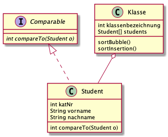

# KlasseStudent

## Lehrziele

- Bubble-Sort
- Insertion Sort
- Unittests

## Aufgabenstellung

- Erstellen Sie eine Klasse "Klasse" die "Student"en verwaltet.

  

- Die Klasse "Student" implementiert das Interface **"Comparable"**.

- Mit den Methode **sortBubble()** und **sortInsert()** in der Klasse "Klasse" werden die Schüler entweder mittels Bubble-sort oder Insertion-Sort sortiert

- Erstellen Sie Unit-Tests in der (bereits vorhandenen) Klasse **KlasseStudentTest.java**. Testen Sie sowohl die Sort-Methoden als auch die Implementierung des Interfaces Comparable

